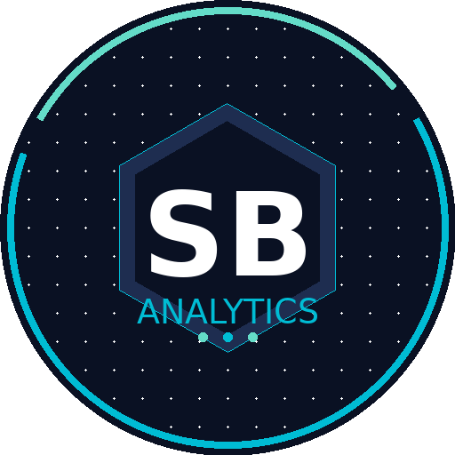

::: {.page-title}
MSc Business Analytics student at Dublin City University with a Mechanical Engineering background, professional operations support experience, and a growing focus on business analytics, data science, and AI-enabled decision support.
:::

::: {.content-page}
::: {.profile-panel}
{fig-alt="Sahil Bhattacharya logo"}

::: {.profile-copy}
### Sahil Ashish Bhattacharya

I am based in Dublin, Ireland and currently studying MSc Business Analytics at Dublin City University. My background combines mechanical engineering, business analysis, operations support, and applied analytics, giving me a practical way of approaching business problems with both structure and technical curiosity.

My work focuses on translating data into useful insight through Python, SQL, reporting, data visualisation, forecasting methods, and clear stakeholder communication. I am particularly interested in business analyst, data analyst, and finance-related analytical roles where data can support better operational, commercial, and strategic decisions.
:::
:::

## Professional Summary

Results-oriented MSc Business Analytics student with two years of professional experience across artificial intelligence and operations support environments. I bring a blend of business analysis, data analysis, stakeholder support, and technical problem-solving across academic, AI, and client-service settings.

I enjoy working end-to-end: understanding requirements, preparing data, building analytical workflows, evaluating outputs, and communicating insights clearly to technical and non-technical audiences. My current learning and project work also covers generative AI, data ethics, data security, forecasting, and presentation skills.

## Education

::: {.details-list}
::: {.detail-item}
**MSc Business Analytics**  
Dublin City University · Dublin, Ireland · 2024-Present

Postgraduate study focused on analytics, data-driven decision-making, business intelligence, reporting, data visualisation, and applied machine learning.
:::

::: {.detail-item}
**B.E. Mechanical Engineering**  
New Horizon Institute of Technology and Management · Thane, India · 2021-2024

Built foundations in mechanics, thermodynamics, applied mathematics, and structured engineering problem-solving.
:::

::: {.detail-item}
**Diploma in Mechanical Engineering**  
Muchhala Polytechnic · Thane, India · 2016-2020

Developed technical grounding in mechanics, manufacturing, thermodynamics, and engineering applications before progressing into degree-level engineering and analytics-oriented study.
:::
:::

## Professional Experience

::: {.info-card}
### Senior Executive Associate / Operations Support

**Concentrix, supporting J.P. Morgan account** · Dublin, Ireland

- Supported business and operational processes in a high-performance client environment.
- Contributed to accurate workflow handling, issue resolution, documentation, and service support.
- Worked in detail-sensitive settings requiring professionalism, timely execution, and strong stakeholder communication.
- Developed experience relevant to business analysis, including process understanding, problem investigation, reporting awareness, and quality-focused support.
:::

## Certifications & Learning

::: {.details-list}
::: {.detail-item}
**Kubicle Diploma: Foundations of Generative AI**  
Completed Nov 2025

Covered generative AI concepts, large language models, ChatGPT applications, and prompt design for business use cases.
:::

::: {.detail-item}
**Python & Data Preparation**  
Python fundamentals, functions, loops, data storage, transformation, visualisation, and data preparation.
:::

::: {.detail-item}
**Data Literacy, Ethics & Security**  
Data and databases, data ethics, ethical thinking, information safety, and responsible data handling.
:::

::: {.detail-item}
**Data Presentation Skills**  
Presenting data, telling stories with data, and communicating analytical findings effectively.
:::
:::

## Professional Interests

::: {.details-list}
::: {.detail-item}
**Business & Data Analysis**  
Requirements understanding, KPI thinking, reporting, process support, and insight generation.
:::

::: {.detail-item}
**Applied Machine Learning**  
Forecasting, model comparison, feature engineering, and evaluation workflows for practical business questions.
:::

::: {.detail-item}
**Generative AI & NLP**  
Prompt engineering, transformer models, text classification, ethical AI, and AI-enabled decision support.
:::

::: {.detail-item}
**Customer & Commercial Analytics**  
Segmentation, CRM strategy, retention, lifecycle value, and stakeholder-ready recommendations.
:::
:::

## Contact

Location
Dublin, Ireland

<a class="contact-row contact-email" href="mailto:saahil.bhatt30@gmail.com">
Email
saahil.bhatt30@gmail.com
</a>

<a class="contact-row" href="tel:+353871199595">
Phone
+353 87 119 9595
</a>

<a class="social-icon-link" href="https://www.linkedin.com/in/sahil-bhattacharya-257924228" target="_blank" rel="noopener" aria-label="LinkedIn profile">
<i class="bi bi-linkedin"></i>
LinkedIn
</a>

<a class="social-icon-link" href="https://github.com/Saahil0206" target="_blank" rel="noopener" aria-label="GitHub profile">
<i class="bi bi-github"></i>
GitHub
</a>

<a class="ark-button" href="cv/sahil-bhattacharya-cv.pdf" target="_blank">Download CV</a>

:::
