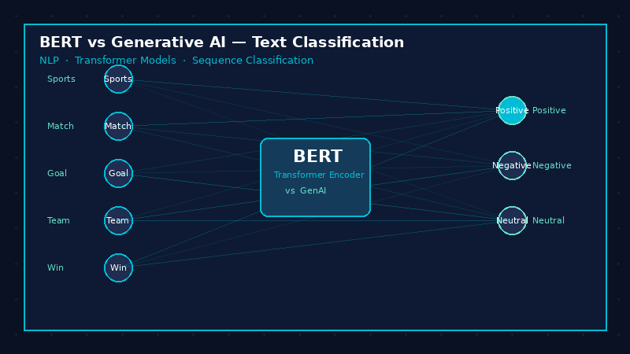
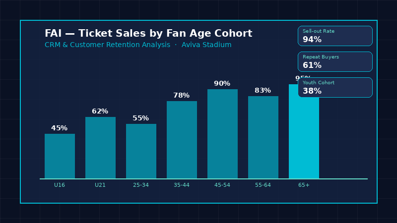

<style>
#title-block-header {
  display: none;
}
</style>

```{=html}
<main class="arkitek-page">
  <section class="ark-hero" id="home-section">
    <div class="ark-container">
      <div class="ark-hero-grid">
        <div class="ark-hero-copy reveal-block">
          <p class="ark-eyebrow">Business Analytics · Data Science · AI · MSc Portfolio</p>
          <h1>Creating Analytical Masterpieces</h1>
          <p class="ark-spaced">S a h i l &nbsp; c o n n e c t s &nbsp; b u s i n e s s &nbsp; a n a l y s i s, &nbsp; d a t a &nbsp; s c i e n c e, &nbsp; A I, &nbsp; a n d &nbsp; c l e a r &nbsp; s t a k e h o l d e r &nbsp; c o m m u n i c a t i o n.</p>
          <div class="ark-actions">
            <a href="projects/" class="ark-button primary">See Projects</a>
            <a href="contact.html" class="ark-button">Let's Grow</a>
          </div>
        </div>

        <div class="ark-hero-panel reveal-block">
          <span>Selected Focus</span>
          <ul>
            <li>NLP and Generative AI</li>
            <li>Smart-city forecasting</li>
            <li>Business analysis and CRM strategy</li>
          </ul>
        </div>
      </div>

      <div class="ark-service-ticker" aria-label="Portfolio focus areas">
        <span>Machine Learning</span>
        <span>Business Analytics</span>
        <span>Data Strategy</span>
        <span>Forecasting</span>
      </div>
    </div>
  </section>

  <section class="ark-section" id="skills-section">
    <div class="ark-container">
      <div class="ark-section-head reveal-block">
        <p>Services</p>
        <h2>What I Do</h2>
        <span>Analytics work from requirements understanding and data preparation to model evaluation, reporting, and stakeholder-ready communication.</span>
      </div>

      <div class="ark-services">
        <article class="ark-service-card reveal-block">
          <span>01</span>
          <h3>Business Analysis</h3>
          <p>Understanding requirements, supporting processes, documenting workflows, and turning business questions into analytical work.</p>
        </article>
        <article class="ark-service-card reveal-block">
          <span>02</span>
          <h3>Data Analysis</h3>
          <p>Cleaning, structuring, reporting, and visualising data so patterns, KPIs, and decisions become clearer.</p>
        </article>
        <article class="ark-service-card reveal-block">
          <span>03</span>
          <h3>Forecasting & ML</h3>
          <p>Building forecasting, classification, and evaluation workflows with practical business trade-offs in mind.</p>
        </article>
        <article class="ark-service-card reveal-block">
          <span>04</span>
          <h3>Communication</h3>
          <p>Turning technical work into reports, dashboards, project stories, and recommendations for business audiences.</p>
        </article>
      </div>
    </div>
  </section>

  <section class="ark-section ark-about" id="about-section">
    <div class="ark-container">
      <div class="ark-about-grid">
        <div class="ark-section-head reveal-block">
          <p>About Me</p>
          <h2>Business analytics with technical depth, operations experience, and commercial awareness.</h2>
        </div>
        <div class="ark-about-copy reveal-block">
          <p>I am an MSc Business Analytics student at Dublin City University with a Mechanical Engineering background and professional experience in AI and operations support.</p>
          <p>My work sits at the intersection of business analysis, data analysis, machine learning, CRM analytics, and decision support. I enjoy working end-to-end: understanding the problem, preparing data, building analytical workflows, and communicating value clearly to technical and non-technical audiences.</p>
          <a href="cv/sahil-bhattacharya-cv.pdf" target="_blank" class="ark-button">View CV</a>
        </div>
      </div>

      <div class="ark-stats">
        <div class="reveal-block"><span>03</span><p>Featured Projects</p></div>
        <div class="reveal-block"><span>MSc</span><p>Business Analytics</p></div>
        <div class="reveal-block"><span>02</span><p>Years Experience</p></div>
      </div>
    </div>
  </section>

  <section class="ark-section" id="portfolio-section">
    <div class="ark-container">
      <div class="ark-section-head reveal-block">
        <p>Portfolio</p>
        <h2>Selected Projects</h2>
        <span>Three applied case studies across NLP, public-sector forecasting, and CRM strategy.</span>
      </div>

      <div class="ark-projects">
        <a class="ark-project-card reveal-block" href="projects/project-bert-genai.html">
          
          <div>
            <span>Sentiment Analysis · NLP</span>
            <h3>BERT vs Generative AI</h3>
            <p>A business-focused comparison of transformer fine-tuning and zero-shot LLM workflows for sentiment analysis.</p>
          </div>
        </a>

        <a class="ark-project-card reveal-block" href="projects/project-gorey.html">
          
          <div>
            <span>Smart City · Forecasting</span>
            <h3>Traffic &amp; Air Pollution Prediction</h3>
            <p>A smart-city forecasting project using IoT sensor and weather data to support proactive decision-making in Gorey.</p>
          </div>
        </a>

        <a class="ark-project-card reveal-block" href="projects/project-fai-crm.html">
          
          <div>
            <span>CRM · Sports Strategy</span>
            <h3>The Fan Growth Engine</h3>
            <p>A data-driven CRM strategy for improving fan retention and lifecycle engagement in Irish football.</p>
          </div>
        </a>
      </div>

      <div class="ark-more reveal-block">
        <a href="projects/" class="ark-button primary">View all projects</a>
      </div>
    </div>
  </section>

  <section class="ark-section" id="media-section">
    <div class="ark-container">
      <div class="ark-section-head reveal-block">
        <p>Media</p>
        <h2>Presentation Spaces</h2>
        <span>Areas for project walkthroughs, notebook demos, and reflective learning media.</span>
      </div>

      <div class="ark-media-grid">
        <article class="ark-media-card reveal-block"><span>01</span><h3>Analytics Presentation</h3><p>Video walkthrough space for project presentations.</p></article>
        <article class="ark-media-card reveal-block"><span>02</span><h3>Data Science Audio</h3><p>Podcast or reflection space for analytics learning.</p></article>
        <article class="ark-media-card reveal-block"><span>03</span><h3>Notebook Walkthrough</h3><p>Technical demo space for modelling and methodology.</p></article>
      </div>
    </div>
  </section>

  <section class="ark-section" id="blog-section">
    <div class="ark-container">
      <div class="ark-section-head reveal-block">
        <p>Blogs</p>
        <h2>Writing & Reflection</h2>
      </div>

      <div class="ark-blog-list">
        <a class="reveal-block" href="projects/project-bert-genai.html"><span>Model Selection</span><strong>Choosing Between BERT and Generative AI</strong></a>
        <a class="reveal-block" href="projects/project-fai-crm.html"><span>CRM Strategy</span><strong>Data Collection Shapes Analysis</strong></a>
        <a class="reveal-block" href="reflection.html"><span>Portfolio Practice</span><strong>Building an E-Portfolio with Quarto</strong></a>
      </div>
    </div>
  </section>

  <section class="ark-contact" id="contact-section">
    <div class="ark-container">
      <div class="ark-contact-grid">
        <div class="reveal-block">
          <p>Contact</p>
          <h2>Let's Talk<br>Your Next Project</h2>
        </div>
        <div class="ark-contact-links reveal-block">
          <span>Dublin, Ireland</span>
          <a href="tel:+353871199595">+353 87 119 9595</a>
          <a href="mailto:saahil.bhatt30@gmail.com">saahil.bhatt30@gmail.com</a>
          <a href="https://www.linkedin.com/in/sahil-bhattacharya-257924228" target="_blank" rel="noopener">LinkedIn</a>
          <a href="https://github.com/Saahil0206" target="_blank" rel="noopener">GitHub</a>
        </div>
      </div>
    </div>
  </section>
</main>
```
